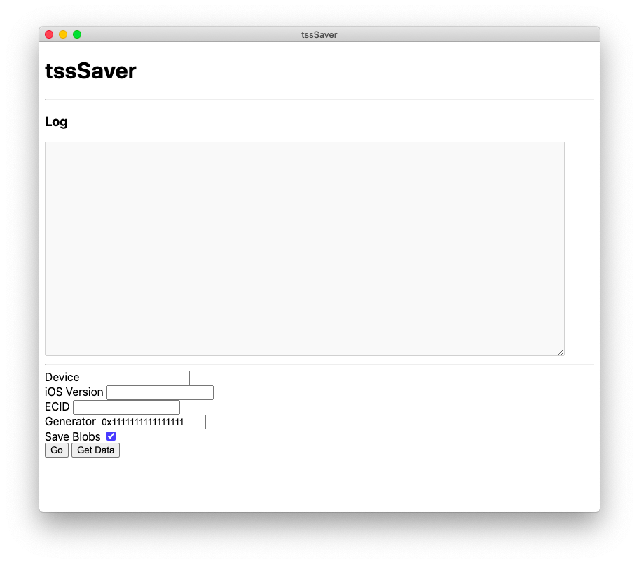

# tssSaver-electron
A GUI wrapper written in electron for tssChecker (WIP)

### Screenshot

## Features
- Saves blobs to Documents folder
- Set a custom nonce generator or use the default one (0x1111111111111111)
- Gets info from device
- Checks if a version is being signed

### TODO
- Build a better UI
- Windows and Linux support
- Let the user select where to save the blobs
- Device info saving, so there's no need to plug the device or enter its data manually every time you want to save blobs
- Automatic iOS version selection, probably by using ipsw.me API
- Device and blobs manager, shows all your devices and their respective blobs
- Setting to show and hide the log

### Credits
[Tihmstar](https://github.com/tihmstar) for [tssChecker](https://github.com/tihmstar/tsschecker)

[Electron](https://github.com/electron) for [Electron](https://github.com/electron/electron)
